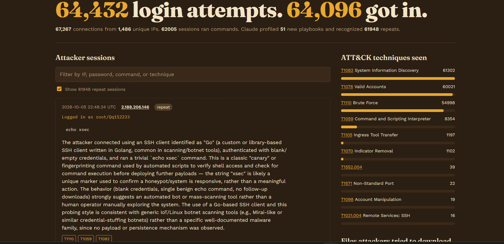
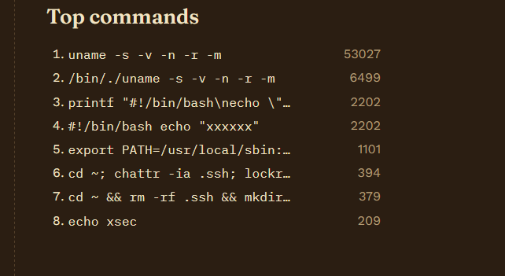
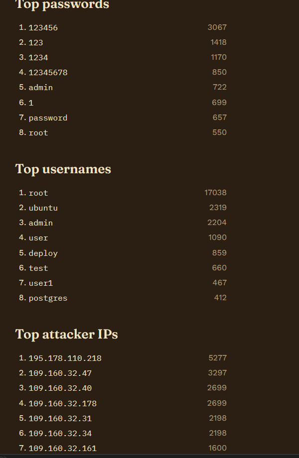

# AI Honeypot

A real SSH honeypot on the open internet, with Claude reading what attackers do and writing up each one in plain English.

Bots find the server on their own, log in with guessed passwords, and run their scripts. They're actually inside [Cowrie](https://github.com/cowrie/cowrie), a fake shell that records everything. A Python script watches Cowrie's log, groups events by attacker session, and asks Claude to profile each new attack pattern, including likely MITRE ATT&CK techniques. A small Flask dashboard shows it all.

Nothing here is simulated. Every session on the dashboard is real internet traffic.

## Results: 13 days on the internet

I ran this on a small DigitalOcean droplet from Sep 23 to Oct 5, 2026, with no announcement and no links to it anywhere. Scanners found it on their own.

| | |
|---|---|
| Connections | 67,267 |
| Unique IPs | 1,486 |
| Login attempts / accepted | 64,432 / 64,096 |
| Sessions that ran commands | 62,005 |
| Claude-profiled new playbooks | 51 |
| Repeat sessions recognized (no new API call) | 61,948 |



**What stood out**

- **Almost all of it was automated.** About 9 in 10 commands were the same quick `uname` check of the operating system. Nine of the ten busiest IPs came from one address block (109.160.32.x) and repeated the same counts, which looks like one operator running one script.
- **Common logins.** `root` was the most tried username by a wide margin and `123456` was the most tried password. Cowrie accepts logins on purpose, so the "got in" number shows what bots try, not how good they are at guessing.
- **Persistence attempts.** 379 sessions wiped `~/.ssh` and added the attacker's own key to `authorized_keys`. The key comment (`mdrfckr`) matches a long-running botnet campaign that other honeypot operators have reported.
- **Malware downloads.** Bots tried to pull files named `kworker`, `telnet`, `telnetd`, and `sshd` from `213[.]232[.]114[.]14`. I checked the `kworker` hash on VirusTotal: 38 of 64 vendors flag it, as a Mirai/Gafgyt-family IoT botnet.






**MITRE ATT&CK techniques seen:** T1110.001, T1078, T1082, T1222.002, T1098.004, T1105, T1059.

**What I'd detect on a real server:** changes to `authorized_keys`, `chattr` on `.ssh`, bursts of SSH sessions from one /24, and servers piping `wget`/`curl` output into `sh`.

Full write-up: [docs/honeypot-findings-report.docx](docs/honeypot-findings-report.docx) (a snapshot from the Oct 5 log export, which had 67,244 connections).

The raw logs aren't published. They contain attacker IPs and the passwords they tried.

## How it fits together

```
internet ──> port 22 ──(ufw redirect)──> Cowrie on 2222 ──> cowrie.json
                                                                │
                                              analyze.py reads new sessions
                                                                │
                                   Claude API ──> attacker_profiles.jsonl + stats.json
                                                                │
                                          dashboard.py (localhost only, viewed over SSH tunnel)

me ──> port 443 ──> real sshd (admin access)
```

## What the analyzer does

- Groups Cowrie's raw log lines into one record per attacker session.
- Only calls Claude when an attacker got in **and** ran commands or downloaded something. Plain password guessing just goes into stats (top usernames, passwords, IPs).
- Fingerprints each session by its commands. If a bot runs the exact same playbook as an earlier one, it reuses that summary instead of paying for a new call. On this server that's the vast majority of sessions.
- Caps Claude calls at 20 per hour so a busy day can't drain the API credits.
- Handles Cowrie's daily log rotation and remembers where it left off after a restart.

## What the dashboard shows

- Totals: login attempts, successful logins, unique IPs, new playbooks vs. repeats
- One card per attack playbook, with how many times and from how many IPs it was seen (repeats hidden behind a toggle)
- ATT&CK techniques ranked by how often they show up, linked to MITRE
- Files attackers tried to download, with VirusTotal links
- Top passwords, usernames, attacker IPs, and commands
- Search across IPs, credentials, commands, and technique IDs

Attacker input is rendered as escaped text, so a command containing HTML or JavaScript can't run in the browser.

## Security decisions

- **Throwaway cloud VM only.** Never on a home network or personal device.
- **Admin SSH on 443, honeypot on 22.** Bots go for 22; 443 also gets through networks that block outbound SSH.
- **Cowrie runs as its own unprivileged user.** The analyzer and dashboard run as a separate admin user who can read Cowrie's logs through group membership, nothing more.
- **Dashboard binds to 127.0.0.1.** Exposing it publicly would tell attackers the box is a honeypot. I view it with `ssh -p 443 -L 5000:localhost:5000 user@server`.
- **API key lives in a root-only env file** (`/etc/honeypot-analyzer.env`, mode 600), not in the code or the repo.
- **No GitHub credentials on the server.** This repo is pushed from my own machine.

## Setup outline

Built on a $6/month DigitalOcean droplet, Ubuntu 24.04.

1. Create a non-root sudo user, enable ufw, move sshd to 443 (`deploy/sshd-port.conf`).
2. Install Cowrie under a dedicated `cowrie` user in a Python venv. Copy `src/cowrie/data/etc/cowrie.cfg.dist` to `etc/cowrie.cfg` and change the default hostname.
3. Redirect 22 to 2222 with the ufw NAT rule in `deploy/ufw-before-rules-nat.txt`.
4. Add the admin user to the `cowrie` group so it can read the logs.
5. Put `analyze.py` and `dashboard.py` in a folder with a venv (`pip install anthropic flask`).
6. Install the three unit files from `deploy/` into `/etc/systemd/system/` and enable them.

## Files

| File | What it is |
| --- | --- |
| `analyze.py` | Session grouping, caching, and Claude analysis |
| `dashboard.py` | Flask dashboard |
| `deploy/*.service` | systemd units for Cowrie, the analyzer, and the dashboard |
| `deploy/ufw-before-rules-nat.txt` | Port 22 → 2222 redirect |
| `deploy/sshd-port.conf` | Moves admin SSH to 443 |

Collected data (`attacker_profiles.jsonl`, `stats.json`) stays on the server and isn't committed.

## A note on the numbers

Cowrie accepts most passwords for `root` on purpose, so it can watch what attackers do after logging in. A high "got in" rate says nothing about how good the bots are at guessing.
